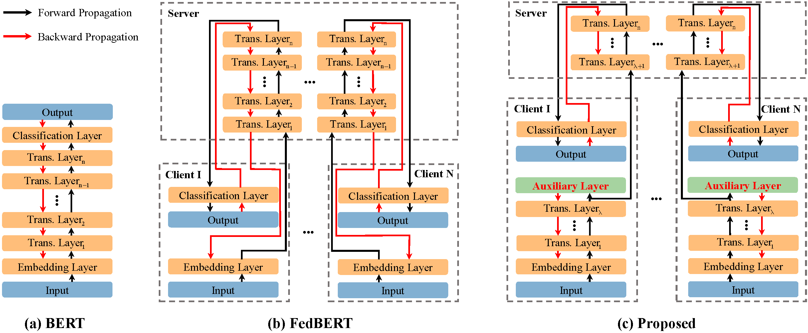
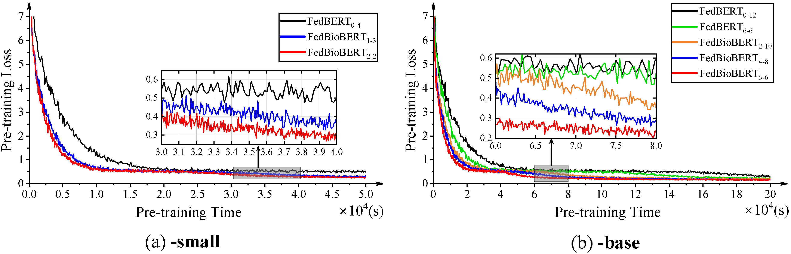
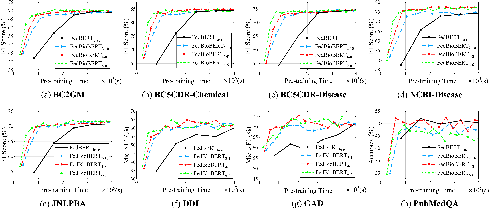

# FedBioBERT: An Efficient Federated Pre-Training Framework for Biomedical Text Mining

## Abstract
Large-scale pre-trained models like BERT have exhibited impressive performance within the realm of biomedical text mining. Nevertheless, the training of such models heavily relies on extensive datasets and substantial computational resources, resources that are typically not at the disposal of individual medical institutions. To tackle this quandary, SplitFed learning has emerged as a prospective solution by breaking down the model architecture. Regrettably, the partitioning of a neural network into client and server components introduces a notable communication overhead, resulting in significant prolongation of the pre-training duration. To mitigate this bottleneck, we propose a proficient and efficacious approach known as FedBioBERT, which capitalizes on local loss for distributed BERT pre-training.  Our approach empowers clients to autonomously update the model without necessitating backpropagated signals from the server. Moreover, we parallelize both client and server processes to expedite the pre-training procedure. We assess the performance of our advanced FedBioBERT on eight downstream biomedical tasks. The outcomes illustrate an average acceleration of 2.03×, accompanied by a remarkable peak speedup of 3.44×, all while upholding performance parity with the state-of-the-art FedBERT.

## Train FedBioBERT
The command for training the FedBioBERT is as follows:
```bash
$HOME/anaconda3/envs/pytorch-py3.6.9/bin/python run.py \
         --arch Roberta --complex_arch master=RobertaServer,worker=RobertaClient \
         --data wikitext-pubmed --pin_memory True --batch_size 16 --num_workers 2 \
         --fl_aggregate scheme=federated_average --hostfile hostfile \
         --manual_seed 7 --pn_normalize True --same_seed_process False \
         --partition_data random \
         --world_conf 0,0,1,1,1 --on_cuda True \
         --n_clients 10 --participation_ratio 0.4 \
         --n_comm_rounds 18 --n_local_rounds 2 \
         --lr 5e-5 --end_lr 5e-6 --warmup_ratio 0.1\
         --num_client_encoder 4 --num_server_encoder 8 \
         --num_device 4 --fedavg_embedding_head True --fedavg_server_model True \
         --gpu_ids 0,0,1,2,3 --num_batch 10000 \
         --data_dir /home/wangzw/pycharm_projects/PubMed --tot_files 18 \
         --checkpoint_save_dir /mnt/7T/wangzw/trained_models/fedbert \
         --from_checkpoint False --from_checkpoint_round 3
```
We also provide the bash for running in HPC cluster with SLURM in sub-directory FedBioBert_10_4_1_3_16_Parallel.

## Framework


## Results




